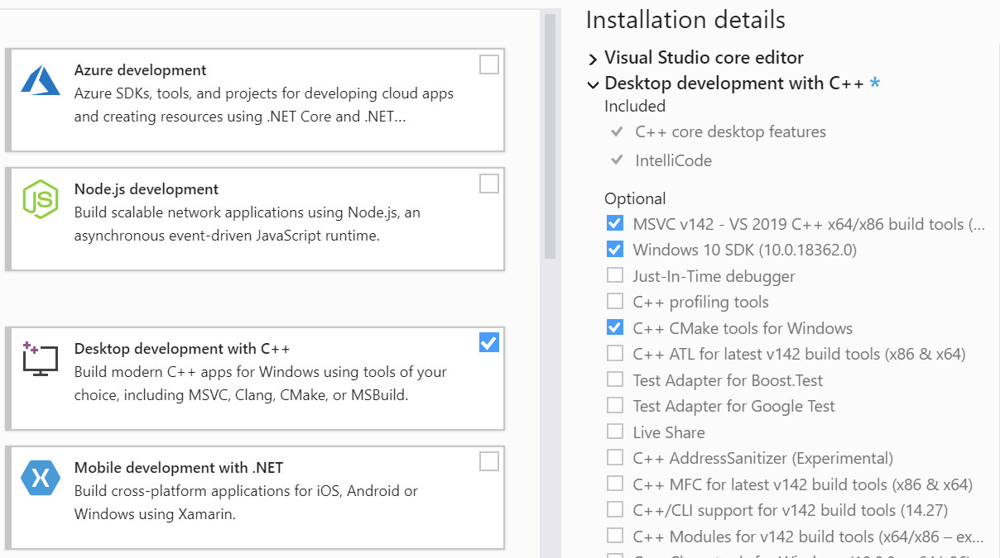

Table of Content
================

1. `Setting up the software stack`_

   a. `On Windows`_
   b. `On macOS`_
   c. `On Linux`_

2. `Getting started`_

   a. `Visual Studio 2019 (or 2017): using the built-in CMake support`_
   b. `Using CMake for other setups`_

Setting up the software stack
=============================

.. note::
   If you are using the university workstations in *Uranus* or *Elgkalv*, you
   can skip to `Visual Studio 2019 (or 2017)`_ as those computers already come
   with Visual Studio 2019 and Git installed.

On Windows
----------

We recommend using Microsoft’s `Visual Studio`_ 2022; the *Community* edition
is free to download and is meant for students (among others). When installing
it, make sure to check the *Desktop development with C++* workload (in the
*Workloads* tab, under the *Desktop & Mobile* group) and to at least have
enabled the individual components found in the figure below.

You will also need to install Git_; you can leave all options to their default
values during the installation.

In case you decided not to use Visual Studio 2019 (nor 2017), you will
additionally need to install CMake_.

         that you have the following individual components selected: “MSVC vXXX
         - VS XXXX C++ x64/x86 build tools” (the Xs should be digits, for
           example “v142 - VS 2019” would be the current one, but if using
           Visual Studio 2022 it might be “v143 - VS 2022”), “Windows XX SDK”
           (again, the Xs should be digits, like “10”), and “C++ CMake tools
           for Windows”.

   Excerpt from the component selection screen of Visual Studio 2019; the
   required components have their checkbox ticked.

On macOS
--------

We recommend using Apple’s Xcode_, which can be installed from the Mac App
Store, but you are free to use other tools though the instructions provided
here might not be sufficient or applicable as a result. Once the installation
is done, you will need to run in a terminal ``xcode-select --install`` to get
the command line tools installed.

You will additionally need to install CMake_.

Once you open the project file in Xcode, switch Scheme to EDAF80_Assignment1, under the Product directory.

On Linux
--------

You are free to use whichever compiler you want (the code has been tested on
both Clang_ and GCC_) as long as it supports C++14. In addition to a
C++14-capable compiler, you will need to install CMake_ and Git_; prefer the
versions shipped by your distribution, as long as CMake 3.13 is available.

Getting started
===============

.. note::
   All the files and folders are specified relative to the root folder (the
   folder containing among others this file, “README.rst”, the “src/” and
   “shaders/” folder), unless specified otherwise.

We will present two different approaches for setting up the assignment code:
you only need to follow one of them. If you are using Visual Studio 2019 (or
2017), both approaches are valid but the first one is recommended.

Visual Studio 2019 (or 2017): using the built-in CMake support
--------------------------------------------------------------

Here is a quick overview of the different steps to be performed:

1. **(Ignore if you are using your own computer)** Create a directory
   called “Program” under your home folder (see the image below). You need to
   use the path to that folder in step 3, in order to be able to compile and
   run the assignments on the lab computers.

   .. figure:: images/GetUserFolder.jpg
      :alt: In the path field of “File Explorer”, click on the arrow symbol found
            between an icon and the path. This will present you with a selection
            of different locations, one of which is your home folder, most likely
            named after you.

      How to access your home folder.

2. Open Visual Studio 2019 and click on the “Clone or check out code” from the
   “Get started” window, or via the menu “File > Clone Repository…”.

3. Enter the URL of this GitHub repository,
   https://github.com/LUGGPublic/CG_Labs, as well as the folder path you
   created in step 1 (or the folder of your choice if using your own computer).

4. Wait until you see the message “CMake generation finished.” in the “Output”
   tab of the bottom panel. At that point, all the dependencies have been
   downloaded and compiled, and you are ready to build and work on the
   assignments.

5. Select which assignment should be run when you press *F5*, by choosing the
   “src\\EDAF80\\EDAF80_Assignment1.exe” option (see the figure below).
   
   .. figure:: images/VS2019_SelectTarget.jpg
      :alt: Use the dropdown feature of the field prefixed by a green triangle in
            the toolbar, to get a slection of targets to run.

      Select which assignment you would like to run; make sure you do not select
      the ones that say “(Install)” like the one above or below the entry pointed
      by the red arrow.

6. Build the source code and run the first assignment: you should be greeted by
   a window looking like the image below.

   In case you do not get a window or its content looks different, look at the
   output from the program which you can see in the same “Output” tab as used
   in step 4, though you should change from the “CMake” output to the “Debug”
   one; this logs can also be found in “out/<CONFIG>/src/EDAF80/logs.txt”
   (replace *<CONFIG>* by “x64-Debug” or “x64-Release” depending on the current
   building configuration you are using in Visual Studio).

   .. figure:: images/Assignment1_StartWindow.jpg
      :alt: The Earth rendered on a dark background.

      The first assignment running when launched for the first time.

Using CMake for other setups
----------------------------

Here, you will use CMake directly to generate the project files. We will
demonstrate how to do it using the CMake GUI, but you can also use CMake from
the command line to achieve the same results.

1. Download, or clone, the framework from the GitHub repository at
   https://github.com/LUGGPublic/CG_Labs; the resulting folder will be later
   referred to as “code”, but you are free to use whatever name you want.

2. In the folder containing “code”, create a new folder named “build” that will
   contain all the binaries and object files.

3. Let us generate the project or build files specific to your setup. This can
   either be done via the command line or via a GUI; both will be presented.

   **If you are using the command line**, run ``cmake -G <GENERATOR> -S “code”
   -B <BUILD>`` where “<BUILD>” refers to the build folder create in step 2,
   and “<GENERATOR>” is one of the generators supported by CMake, such as
   “Xcode”, “Unix Makefiles”, “Ninja”; the full list of supported generators
   can be found at `cmake-generators(7)`_.

   **If you prefer to use the GUI**, follow these steps instead:

   a. Launch the CMake GUI tool, and fill in the paths to the source and binary
      folders.

   b. Now press the “Configure” button (found towards the bottom of the GUI), and
      select the generator you want to use: for example, “Visual Studio 2019” on
      Windows, “Xcode” on macOS, “Ninja” or “Unix Makefile” on Linux.

   c. Once the configuration is done, CMake variables and their values will appear
      above the previously mentioned “Configure” button, highlighted in red
      meaning their value changed since the last configuration. If you wish to
      change the window resolution, or some other variables, go ahead and do it.
      Either way, press the “Configure” button once more to remove the
      highlighting from all variables, and then press the “Generate” button to its
      right, to generate the project files; you will find them in the “build”
      folder you specified.

4. Build the source code using your IDE, or via the command line by running
   ``cmake --build <BUILD>`` where “<BUILD>” is the path to your build folder.

5. If you are using an IDE like Visual Studio or Xcode, you should change which
   assignments is started when running the project:

   Visual Studio
     Right click on the “EDAF80_Assignment1” project in the “Solution Explorer”
     tab (usually in the left panel) and select the “Select as StartUp Project”
     menu item.

   Xcode
     In the top left corner of the centre part of the window, there should be a
     field saying something like “ALL_BUILD > My Mac”. Click on it to get a
     dropdown of all the existing targets, and simply click on
     “EDAF80_Assignment1” from it.

6. Run the first assignment: you should be greeted by a window looking like the
   figure below.

   In case you do not get a window or its content looks different, look at the
   logs which you can find in “<BUILD>/src/EDAF80/logs.txt” (replace
   *<BUILD>* by the path to your build folder); if you manually started
   the assignment from the command line, the file will be found in the current
   working directory.

   .. figure:: images/Assignment1_StartWindow.jpg
      :alt: The Earth rendered on a dark background.

      The first assignment running when launched for the first time.

.. _Visual Studio: https://visualstudio.microsoft.com/vs/features/cplusplus/
.. _Git: https://git-scm.com/
.. _CMake: https://cmake.org/
.. _Xcode: https://apps.apple.com/se/app/xcode/id497799835?mt=12
.. _Clang: https://clang.llvm.org/
.. _GCC: http://gcc.gnu.org/
.. _cmake-generators(7): https://cmake.org/cmake/help/latest/manual/cmake-generators.7.html
